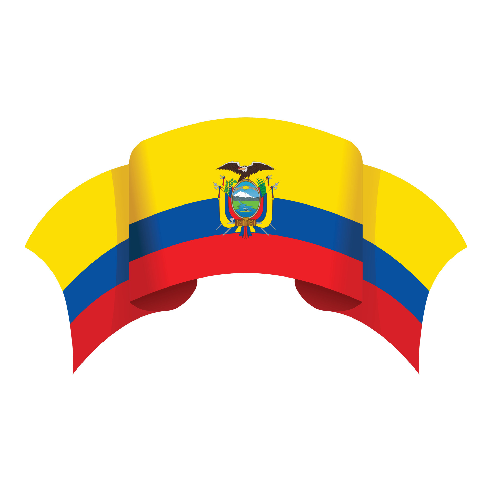

**ECUADOR ES UNA DELICIA**😁😁😁

La gastronomía de Ecuador es un reflejo vibrante de su diversidad cultural y geográfica. Este pequeño país sudamericano ofrece una increíble variedad de platos que varían según las regiones: la costa, la sierra, la Amazonía y las islas Galápagos. Cada zona del país tiene sus propias especialidades, basadas en ingredientes frescos y locales.

Desde el marisco fresco de la costa, como el famoso *ceviche*, hasta los platos abundantes de la sierra, como el *locro de papas*, la cocina ecuatoriana combina sabores indígenas con influencias españolas y africanas. Los platos son sencillos pero llenos de sabor, utilizando ingredientes naturales y técnicas tradicionales que han sido transmitidas de generación en generación.
A continuación, te presentamos algunos de los mas famosos platillos que ofrece nuestro Ecuador.

-[Encebollado](encebollado.md)😊 

-[Locro de papas](locro.md)😎

-[Fanesca](fanesca.md)🫡 

-[Hornado](hornado.md)😶‍🌫 

-[Llapingachos](llapingachos.md)😜

-[Cuy asado](cuy.md)🤠 

-[Comidas típicas de cada provincia](ciudades.csv)