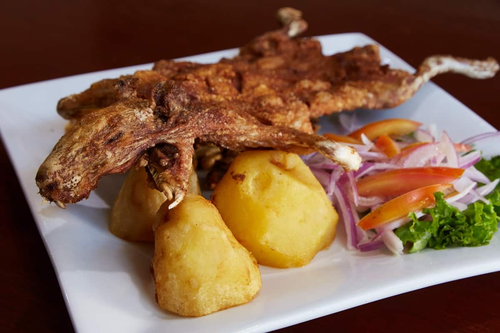

# CUY ASADO 🐹🔥

El cuy asado es uno de los platos más antiguos y tradicionales de la gastronomía andina, especialmente en países como Ecuador, Perú y Bolivia. Este platillo, considerado un manjar en las regiones altoandinas, tiene un profundo arraigo cultural y es parte esencial de muchas celebraciones y rituales indígenas. En Ecuador, el cuy asado es particularmente popular en la Sierra, donde se cría y consume desde tiempos precolombinos.

El cuy, que es un tipo de roedor doméstico, se prepara asado a la parrilla o en horno de leña. Antes de la cocción, el cuy se adoba cuidadosamente con una mezcla de ajo, comino, achiote, y otras especias locales. En algunas regiones, también se utiliza una pasta de maní para untarlo, lo que añade un sabor único y una textura crujiente a la piel. El proceso de cocción es lento y requiere paciencia, ya que el cuy debe cocinarse uniformemente para obtener una carne tierna y jugosa, mientras la piel adquiere un dorado intenso y una textura crujiente.

El cuy asado se sirve entero, acompañado generalmente de papas o papas chauchas (pequeñas y de sabor intenso), mote (maíz cocido), habas, y a veces una ensalada de lechuga, tomate, y cebolla. En algunas versiones, se añade salsa de maní o ají, que aporta un toque picante y realza los sabores del plato.

Este plato no solo es apreciado por su sabor único, sino también por su alto valor nutricional, ya que la carne de cuy es rica en proteínas, baja en grasa, y contiene ácidos grasos omega-3. Culturalmente, el cuy asado está asociado con la fertilidad, la abundancia y la prosperidad. Es común encontrarlo en fiestas patronales, bodas, y otras celebraciones importantes, donde su consumo se considera un símbolo de respeto y buen augurio.

El cuy asado es, por tanto, mucho más que un alimento; es una manifestación de la identidad cultural de los pueblos andinos, un vínculo entre el pasado y el presente que ha resistido el paso del tiempo y continúa siendo un platillo central en la mesa de muchas familias de la Sierra ecuatoriana y otras regiones de los Andes.