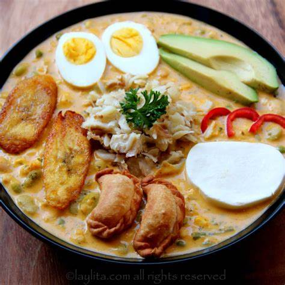

# FANESCA

La fanesca es un plato tradicional ecuatoriano, especialmente asociado con la Semana Santa y la Cuaresma. Es una sopa espesa y rica, que representa una de las expresiones más complejas y simbólicas de la cocina ecuatoriana, combinando ingredientes de origen indígena y europeo.

La fanesca se prepara con una base de granos frescos como el maíz, habas, fréjol, lentejas, arvejas, y chochos, a los que se les añade calabaza (zapallo) y varios tipos de tubérculos, como la papa y el melloco. El caldo se enriquece con leche, queso, y crema, y se condimenta con especias como el comino, el ajo, y el achiote, que le da un color dorado.

Uno de los ingredientes clave es el bacalao seco, que se rehidrata y desmenuza, aportando un sabor salado que contrasta con la dulzura de los vegetales. La fanesca se sirve adornada con rodajas de huevo duro, empanadas de viento (empanadas pequeñas rellenas de queso y fritas), plátano maduro frito, y cebolla encurtida.

Cada hogar y región tiene su propia receta de fanesca, pero en general, es un plato que simboliza la unión, la diversidad de los productos de la tierra, y la tradición familiar durante la Semana Santa en Ecuador.

## 1. Valor Nutricional y Beneficios para la Salud
**Composición Nutricional:**
La fanesca es un plato nutritivo que ofrece una combinación de *proteínas, carbohidratos y fibra*, gracias a sus ingredientes variados. Los granos como el maíz, el fréjol, y las legumbres aportan una cantidad significativa de proteínas vegetales y fibra dietética. La calabaza y los otros vegetales aportan vitaminas y minerales esenciales, mientras que el pescado seco, que es una fuente de proteínas de alta calidad, enriquece el plato con ácidos grasos *omega-3*.

**Beneficios para la Salud:**
La fanesca es una comida completa y equilibrada que puede apoyar una dieta saludable. La alta fibra de las legumbres y granos contribuye a la salud digestiva, mientras que las vitaminas y minerales de los vegetales fortalecen el sistema inmunológico. El pescado seco aporta beneficios cardiovasculares debido a su contenido en omega-3, promoviendo la salud del corazón. Además, la fanesca es rica en energía, ideal para las festividades que requieren un aporte calórico adicional.

## 2. La Fanesca en la Gastronomía Moderna
**Innovaciones e Interpretaciones:**
Chefs contemporáneos están reinventando la fanesca para adaptarla a las preferencias actuales sin perder su esencia tradicional. Algunas innovaciones incluyen la incorporación de técnicas culinarias modernas, como el uso de espuma de maíz o la incorporación de ingredientes exóticos, para ofrecer nuevas texturas y sabores mientras se mantiene el respeto por la receta original.

**Fanesca y Turismo Gastronómico:**
La fanesca se ha convertido en una atracción turística importante durante la *Semana Santa* en Ecuador, promoviendo la rica tradición culinaria del país. Restaurantes y festivales gastronómicos destacan este plato como una experiencia cultural única, ofreciendo a los visitantes la oportunidad de disfrutar de una receta ancestral en su contexto tradicional y contemporáneo.

[Video tutorial de la preparación de la fanesca](https://www.youtube.com/watch?v=WSlDzsVy2io)