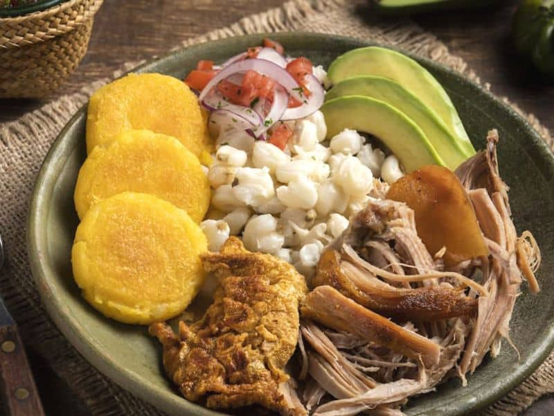

 # HORNADO 😋

El hornado es un plato emblemático de la gastronomía ecuatoriana, especialmente popular en la región de la Sierra. Consiste en carne de cerdo que ha sido adobada con una mezcla de ajo, comino, achiote, y chicha de jora, un tipo de bebida fermentada tradicional. Luego, la carne se cocina lentamente en un horno de leña, lo que le da su característico sabor ahumado y una textura jugosa por dentro, con la piel crujiente por fuera.

El plato se sirve tradicionalmente acompañado de mote (maíz blanco cocido), llapingachos (tortillas de papa), ensalada de lechuga, tomate y cebolla, y a veces se añade una porción de aguacate o chorizo. Es una verdadera muestra de la riqueza culinaria de los Andes ecuatorianos.

El hornado no solo es un festín para el paladar, sino también un reflejo de las tradiciones culinarias que se han transmitido de generación en generación en los Andes ecuatorianos. Este plato es muy común en celebraciones, ferias y festivales, donde se convierte en el centro de la reunión familiar y comunitaria, simbolizando la abundancia y la hospitalidad.

## 1. Valor Nutricional y Beneficios para la Salud

**Composición Nutricional:** El hornado es una fuente rica en proteínas debido a la carne de cerdo, que también aporta una cantidad significativa de vitaminas del grupo B, como la B12 y niacina. La carne de cerdo es baja en carbohidratos y contiene minerales esenciales como hierro y zinc. El contenido de grasa puede variar según el corte de cerdo utilizado, pero la cocción en horno de leña puede ayudar a reducir el contenido de grasa, ya que parte de la grasa se derrite durante el proceso.

**Beneficios para la Salud:** El hornado, cuando se consume con moderación y acompañado de vegetales frescos, puede ser parte de una dieta equilibrada. La carne de cerdo ofrece proteínas de alta calidad, y los acompañamientos como ensaladas y mote proporcionan fibra y micronutrientes adicionales. Sin embargo, debido al contenido de grasa, es recomendable disfrutarlo como parte de una dieta variada y balanceada.

## 2. El Hornado en la Gastronomía Moderna

**Innovaciones e Interpretaciones:** Chefs contemporáneos están explorando nuevas formas de presentar el hornado, combinando técnicas tradicionales con enfoques modernos. Algunos están experimentando con maridajes de sabores internacionales y métodos de cocción alternativos para reinventar este plato clásico, manteniendo su esencia pero aportando un toque innovador.

**Hornado y Turismo Gastronómico:** El hornado se ha convertido en una atracción destacada en el turismo gastronómico ecuatoriano. Restaurantes y ferias locales destacan este plato en su oferta para visitantes, ofreciendo una experiencia auténtica de la cocina andina. Su popularidad entre los turistas ha ayudado a preservar y promover las tradiciones culinarias de la región, convirtiéndolo en un símbolo de la rica herencia gastronómica de Ecuador.

[Video tutorial de la preparación del hornado](https://www.youtube.com/watch?v=wWzDb8uB6wo)