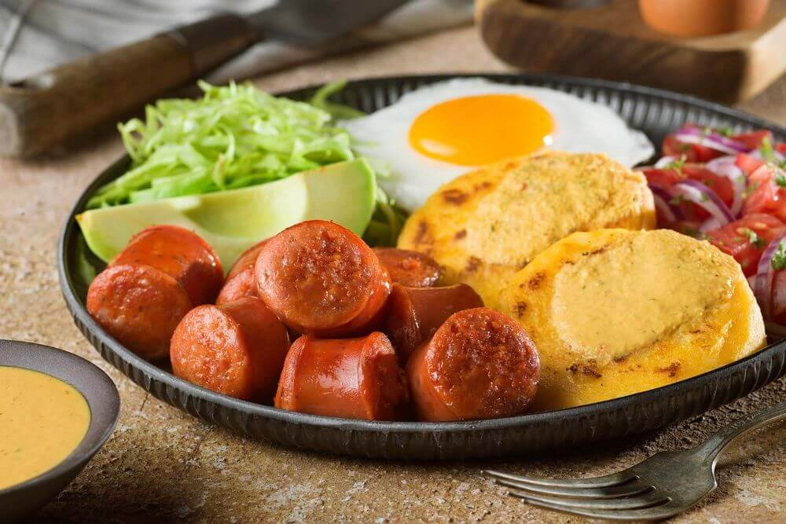

# LLAPINGACHO 🥔

El llapingacho es un plato tradicional y muy apreciado de la gastronomía ecuatoriana, originario de la región de la Sierra. Se trata de una deliciosa tortilla de papa, que se elabora con papas cocidas y aplastadas, mezcladas con un poco de mantequilla y rellenas con queso fresco. Las tortillas se cocinan a la plancha hasta que adquieren un exterior dorado y ligeramente crujiente, mientras que el interior se mantiene suave y cremoso.

El llapingacho se sirve típicamente acompañado de una variedad de guarniciones, como chorizo, huevo frito, ensalada de lechuga, tomate, y aguacate. En algunas regiones, también se agrega una porción de mote (maíz blanco cocido) o se acompaña con salsa de maní, que complementa el sabor de las tortillas y añade una capa de sabor rica y suave.

Este plato es un ejemplo perfecto de la fusión de ingredientes sencillos que, cuando se combinan, crean una experiencia culinaria reconfortante y llena de sabor. El llapingacho no solo es un favorito en los hogares ecuatorianos, sino que también se encuentra en mercados, restaurantes, y celebraciones, siendo un plato que representa la esencia de la cocina tradicional de los Andes.

## 1. Valor Nutricional 🥔💪
**Composición Nutricional:**
los llapingachos son una fuente de carbohidratos gracias a la papa, su ingrediente principal. Además, al estar rellenos de queso, aportan proteínas y calcio, esenciales para el desarrollo y mantenimiento de huesos y músculos. Dependiendo de los acompañamientos, como el chorizo o el huevo frito, también se puede añadir una mayor cantidad de proteínas y grasas.

**Beneficios para la Salud:**
los llapingachos, consumidos en porciones moderadas, son una opción energética y satisfactoria dentro de la dieta diaria. La papa, un ingrediente clave, es rica en *vitaminas C y B6*, y en minerales como el potasio. El queso proporciona proteínas y nutrientes esenciales para la salud ósea. Sin embargo, es importante equilibrar su consumo con otros alimentos para mantener una dieta saludable.

## 2. Los Llapingachos en la Gastronomía Moderna 🥔🍽️
**Innovaciones e Interpretaciones:**
En la gastronomía moderna, los llapingachos han sido reinterpretados por chefs que experimentan con diferentes tipos de quesos y rellenos, como carnes, vegetales o mariscos. Algunos han optado por versiones más saludables, utilizando papas cocidas al vapor en lugar de fritas, o incorporando ingredientes gourmet para dar un toque sofisticado a este plato tradicional.

**Llapingachos y Turismo Gastronómico:**
Los llapingachos han ganado popularidad no solo en Ecuador, sino también entre los turistas que buscan experimentar la autenticidad de la cocina andina. Este plato se ha convertido en un símbolo culinario en los mercados y festivales gastronómicos, donde los visitantes pueden disfrutar de su sabor y conocer la rica tradición que lo rodea. Además, ha sido promocionado en rutas de turismo gastronómico, permitiendo a los turistas descubrir la diversidad y riqueza de la comida ecuatoriana.