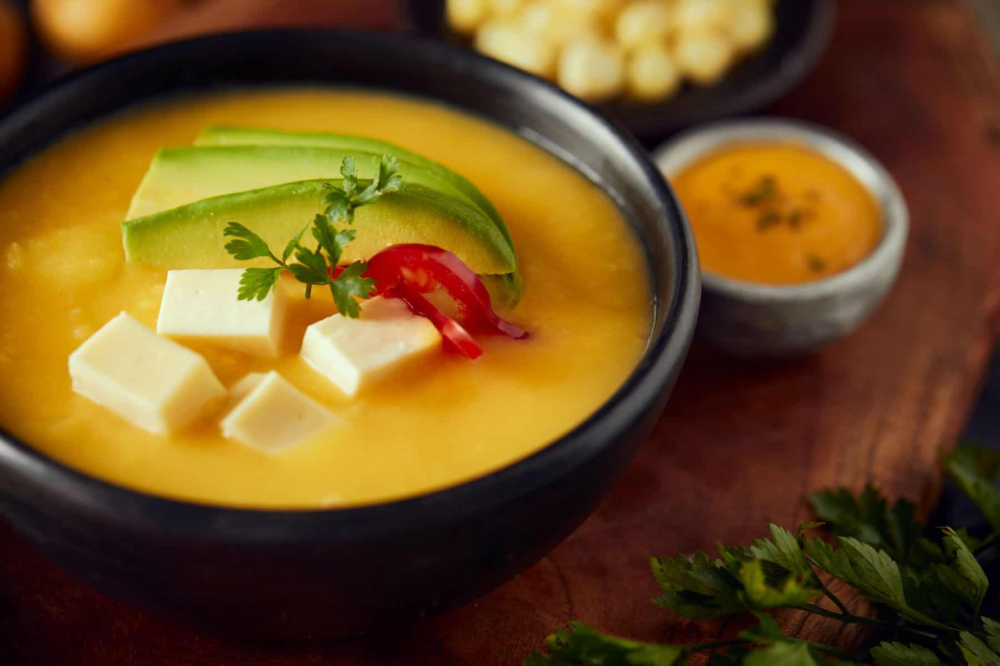

El locro de papas es un plato emblemático de la cocina ecuatoriana, especialmente popular en la región andina del país. Se trata de una sopa espesa y cremosa, cuyo ingrediente principal son las papas, que se cocinan hasta deshacerse, dando al plato su textura característica.

El locro se enriquece con queso fresco, que se derrite en la sopa, aportando un sabor suave y cremoso. La base del caldo suele incluir cebolla, ajo, comino, y achiote, que le da un color anaranjado y un sabor distintivo. También se le puede añadir leche o crema para aumentar su cremosidad.

El locro de papas se sirve tradicionalmente con aguacate en rodajas, que se coloca sobre la sopa justo antes de servir, y se adorna con un poco de cilantro fresco. Es un plato reconfortante, ideal para los días fríos, y es un claro reflejo de la riqueza culinaria de la región andina del Ecuador.
